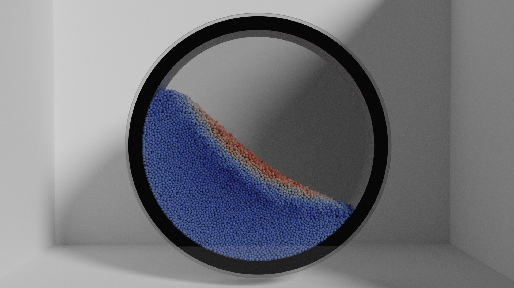

# GranuDrum Digital Twin

## Description
A discrete element method (DEM) Digital Twin of the Granutools' GranuDrum powder characterisation tool built using PICI-LIGGGHTS.
This digital twin allows users to understand in more depth the behaviour of a powder in the GranuDrum. 
Particle properties can be defined and the individual particle data or bulk powder behaviour extracted and analysed.

## Getting Started
To be able to use this digital twin an installation of PICI-LIGGGHTS is required. A step-by-step guide of how to install PICI-LIGGGHTS can be found [here](https://uob-positron-imaging-centre.github.io/InstallingPICI-LIGGGHTS/).

## How to use the Digital Twin
Using the digital twin is very simple but to explore the behaviour of powder in the GranuDrum digital twin the particle properties are required. 
Most of the particle properties can be easily defined by changing the values in the parameters.txt file.
The parameters.txt file allows the sliding friction, rolling friction, restitution, material density, cohesive energy density, drum speed (RPM) and number of particles to be defined.
The particle size distribution also needs to be defined. This is currently done by going into the granudrum_liggghts.sim file and manually changing it.
Previous knowledge of LIGGGHTS is required to do this currently but is planned to be improved in the future.

## Roadmap
- [x] Add parameter text input file.
- [ ] Develop way of automatically inputting particle size distribution.
- [ ] Investigate including a compiled version of PICI-LIGGGHTS to the digital twin files to avoid everyone having to compile it themselves.
- [ ] Include finalised post-processing script to calculate dynamic angle of repose and cohesive index from the simulation.
- [ ] Work out a way of calculating number of particles required in a certain volume.

## Issues
If you run into any issues or bugs let us know by raising and issue on the GitLab! If you find a way to fix it raise a pull request!

## Authors and acknowledgment
This digital twin wouldn't be possible without the help of all those below!
- Ben Jenkins (Granutools, University of Birmingham)
- Dominik Werner (University of Birmingham)
- Andrei Leonard Nicusan (University of Birmingham)
- Jack Sykes (University of Birmingham)
- Dr. Kit Windows-Yule (University of Birmingham)
- Prof. Jonathan Seville (University of Birmingham)
- Aurelien Neveu (GranuTools)
- Geoffroy Lumay (University of Liege, GranuTools)
- Filip Francqui (GranuTools)

## Project status
Actively being worked on!
